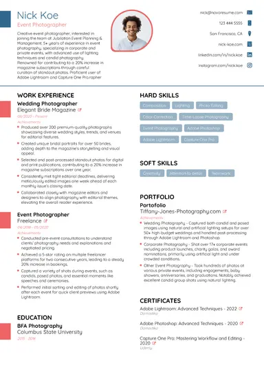
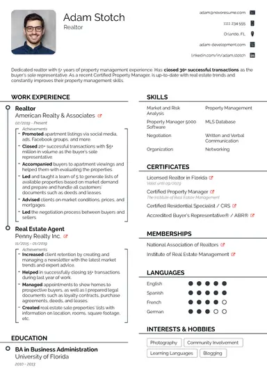
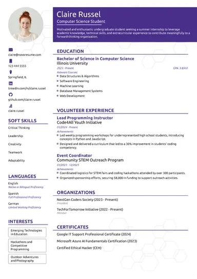
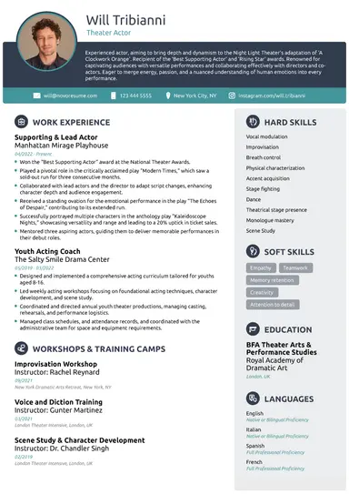

<div align="center">


# ResumeCraft

**Build a clean, professional resume in just 2 minutes, for free.**

A lightweight, front-end resume builder designed for students. Fill in your details, pick a template, and download your resume as a PDF.

### 🔗 [**Live Demo: Try ResumeCraft Now**](https://vedantmule04.github.io/ResumeCraft/)


</div>

---

## 📖 About the Project

ResumeCraft helps students and freshers create simple, professional resumes without signing up for anything or installing software. Everything runs in the browser: there is no backend, and your data never leaves your device.

This is my first web development project, built using HTML, CSS, and vanilla JavaScript.

## 🌐 Live Demo

👉 **https://vedantmule04.github.io/ResumeCraft/**

No installation needed. Open the link, fill in your details, choose a template, and download your resume as a PDF.

## ✨ Features

- **4 resume templates**: Professional, Modern, Student, and Hybrid
- **Simple step-by-step flow**: enter details → choose a template → preview → download
- **Profile photo upload** with an instant circular preview
- **Complete sections**: personal info, career objective, education, hard skills, soft skills, experience, projects, certifications, languages, and interests
- **One-click PDF download** powered by html2pdf.js
- **Privacy-friendly**: all data is stored locally in your browser (`localStorage`)
- **No dependencies or build step**: just open and use

## 🎨 Templates

| Professional | Modern | Student | Hybrid |
|:---:|:---:|:---:|:---:|
|  |  |  |  |

## 🚀 How It Works

1. **Landing page** (`index.html`): click **Create My Free Resume**
2. **Builder** (`builder.html`): fill in your details and upload a photo
3. **Templates** (`templates.html`): choose the layout you like
4. **Preview** (`preview.html`): review your resume, then click **Download PDF** (or **Edit Resume** to go back and make changes)

## 🛠️ Tech Stack

- **HTML5**: structure
- **CSS3**: styling and template layouts
- **JavaScript (Vanilla)**: form handling and template rendering
- **Web Storage API (`localStorage`)**: passing data between pages
- **[html2pdf.js](https://github.com/eKoopmans/html2pdf.js)**: client-side PDF generation
- **Google Fonts (Poppins)**: typography
- **GitHub Pages**: hosting

## 📁 Project Structure

```
ResumeCraft/
├── images/                # Logo and template thumbnails
├── index.html             # Landing page
├── style.css              # Landing page styles
├── builder.html           # Resume details form
├── builder.css            # Builder page styles
├── builder.js             # Saves form data to localStorage
├── templates.html         # Template selection page
├── templates.css          # Template page styles
├── templates.js           # Saves the chosen template
├── preview.html           # Resume preview + PDF download
├── preview.css            # Styles for all 4 templates
├── preview.js             # Renders the selected template
└── README.md
```

## ⚙️ Run Locally

```bash
# Clone the repository
git clone https://github.com/VedantMule04/ResumeCraft.git

# Go into the project folder
cd ResumeCraft
```

Then open `index.html` in your browser. You can also use the **Live Server** extension in VS Code.

> **Note:** An internet connection is needed to load Google Fonts and the html2pdf.js library from their CDNs.

## 📚 What I Learned

- Building multi-page websites with HTML and CSS
- Handling forms and file uploads with JavaScript
- Passing data between pages using `localStorage`
- Rendering dynamic content with template literals
- Generating PDFs in the browser with html2pdf.js
- Deploying a static website with GitHub Pages

## 🗺️ Roadmap

- [ ] Support multiple entries for education, experience, and projects
- [ ] Live preview while typing
- [ ] Input validation
- [ ] Fully responsive layout for mobile devices
- [ ] More resume templates
- [ ] Customizable template colors and fonts

## 🤝 Contributing

Suggestions and feedback are welcome! Feel free to open an [issue](https://github.com/VedantMule04/ResumeCraft/issues) or submit a pull request.

## 👤 Author

**Vedant Nandkumar Mule**

- GitHub: [@VedantMule04](https://github.com/VedantMule04)
- LinkedIn: [Vedant Mule](https://www.linkedin.com/in/vedant-mule-396a9a440/)

---

<div align="center">

If you found this project helpful, please consider giving it a ⭐

</div>
